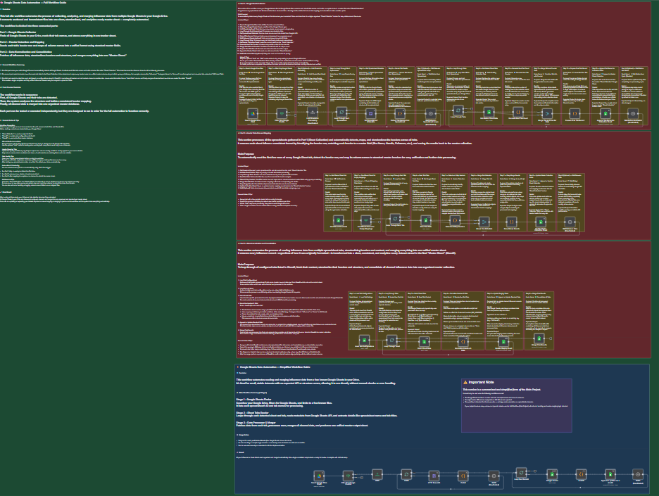

# 🧠 **Google Sheets Data Automation — Full Workflow Guide**

### 📘 **Overview**

This n8n workflow automates the process of **collecting, analyzing, and merging influencer data** from multiple Google Sheets in your Google Drive.  
It transforms scattered, inconsistent files into a **clean, standardized, analytics-ready master sheet** — completely automated.

The workflow is divided into three connected parts:

1. **Google Sheets Collector** – Finds all sheets and tabs across Drive.  
2. **Header Detection & Mapping** – Unifies all column names.  
3. **Data Normalization & Consolidation** – Cleans and merges all influencer data into one master sheet.

---

## ⚙️ **How It Works**

1. **Drive Scan & Sheet Collection**  
   The workflow scans your entire Google Drive, identifies all Google Sheets, and lists their tab names in a “Sheet Collection” tracker.

2. **Header Detection & Mapping**  
   Each sheet’s header row is read and mapped into a unified schema using a built-in synonym dictionary.  
   Example: `Influencer`, `Instagram Name`, and `Account` are all standardized to `INF Name`.

3. **Data Normalization & Consolidation**  
   The workflow then fetches all influencer data, cleans inconsistent fields, merges extra info into an “Extra Data” column, and appends all records into a single **Master Sheet**.

---

## 🧩 **Core Process Overview**

| Stage  | Function              | Output                     |
| ------ | --------------------- | -------------------------- |
| Part 1 | Sheet & Tab Detection | “Sheet Collection” tracker |
| Part 2 | Header Mapping        | Unified header reference   |
| Part 3 | Data Merge            | Final Master Sheet         |

Each part can be tested separately but works best when run sequentially.

---

## 🧭 **Setup Guide**

### 1️⃣ **Preparation**

* Connect your **Google Drive** and **Google Sheets** credentials in n8n.  
* Prepare a few Google Sheets in your Drive for workflow output and configuration, for example:  
  * A sheet to **store detected files and tabs** (output from Part 1)  
  * A sheet for **configuration or header mapping** (used in Part 2 or 3)  
  * A **final master sheet** to collect and merge all cleaned data  

### 2️⃣ **Execution**

* Run **Part 1** to detect all files and tabs.  
* Run **Part 2** to build the header mapping schema.  
* Run **Part 3** to consolidate and clean data.

---

## 🧠 **Tips & Best Practices**

* Include a short delay (2–3 seconds) between loops to prevent **Google API rate limits**.  
* Keep column names consistent for faster header mapping.  
* Clean unused or duplicate sheets before running.  
* Regularly refresh “Sheet Collection” when new files are added.  
* Use **n8n’s Cron trigger** to schedule:
  * Part 1 daily or weekly.
  * Part 2 after adding new sheets.
  * Part 3 on demand for rebuilding.

---

## 🧾 **Example Result**

After the full run:

* All influencer data across Drive becomes **automatically merged**.  
* Headers are standardized (consistent naming).  
* The final “Master Sheet” is ready for analytics or CRM upload.

---

## 🪪 **Requirements**

* Active **Google account** with access to Drive & Sheets.  
* Connected **Google credentials** in n8n.  
* n8n version ≥ 1.50 recommended.

---

## 🧩 **Tech Stack**

* **Platform:** n8n  
* **Integrations:** Google Drive API, Google Sheets API  
* **Data Handling:** Mapping, Merging, Cleaning  
* **Automation Type:** Scheduled Data Consolidation  

---

## 📸 **Preview**

  

> *Workflow diagram showing the 3-step process: detection, mapping, and consolidation.*

---

## 📬 **Author**

**Created by:** Sief Shama  
**Focus:** Automation Development · Data Engineering · AI Integration  
**LinkedIn:** [linkedin.com/in/siefshama](https://www.linkedin.com/in/siefshama/)
