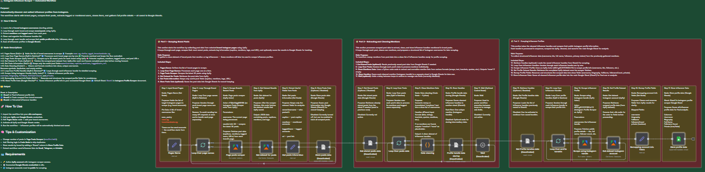

# 💼 **Instagram Influencer Scraper — Profile Extractor**

This n8n workflow automates collecting detailed **influencer data** from Instagram usernames using a public scraper API.  
It extracts profile info such as **bio, followers count, category, contact details,** and **engagement metrics**, then writes it automatically to **Google Sheets** — ideal for influencer research, campaign targeting, or CRM integration.

---

## 🚀 **Overview**

The workflow takes a list of **Instagram usernames** (manually entered or fetched from a previous workflow) and scrapes their **public profiles**.  
All results are neatly stored in a Google Sheet for easy analysis.

**Main Features:**
- Automatically collects influencer data from usernames  
- Gathers public profile info like bio, followers, and engagement stats  
- Writes clean, structured data to Google Sheets  
- Can be combined with hashtag scrapers or CRM workflows  
- Supports batching and scheduling to avoid API limits  

---

## ⚙️ **Workflow Steps**

1. **Start Node** — Trigger manually or on schedule.  
2. **Google Sheets Node** — Fetch a list of usernames to process.  
3. **Split In Batches** — Handles usernames in small sets for efficiency.  
4. **API Call (Instagram Scraper)** — Retrieves public profile data for each username.  
5. **Set Node** — Formats and maps results into clean fields.  
6. **Google Sheets Node** — Appends structured data into your influencer data sheet.  

---

## 🧩 **Output**

| Column | Description |
|--------|--------------|
| 🟩 **Username** | Instagram handle (without @) |
| 🟨 **Full Name** | Display name from profile |
| 🟦 **Followers** | Total follower count |
| 🟧 **Bio** | Profile bio text |
| 🟥 **Category** | Detected content category or niche |
| 🟪 **Email** | Public contact email (if available) |
| 🟫 **Engagement Rate** | Estimated or scraped metric |

---

## 🧠 **Tips & Customization**

- Combine this workflow with **Project 3 (Hashtag Scraper)** to first collect usernames, then enrich them here.  
- Use **Split In Batches** and **Wait** nodes to prevent rate-limit errors.  
- Add filtering logic to skip duplicates or private profiles.  
- Use a webhook or email node to get notified after each batch completes.  

---

## 🪪 **Requirements**

- 🔑 Access to a **public Instagram scraping API** (e.g., Apify, RapidAPI)  
- 📄 Connected **Google Sheets** credentials in n8n  
- 🌐 Public Instagram accounts (private ones are skipped automatically)  

---

## 🧰 **Preparation**

Before running:
- Connect **Google Sheets** and your **Instagram Scraper API** credentials in n8n  
- Create a Google Sheet named `InfluencerProfiles` with headers matching the output table  
- Add usernames (one per row) in the first column before starting the workflow  

---

## 💡 **Example Use Case**

A marketing agency has a list of influencer usernames.  
They run this workflow to automatically collect detailed data — bios, followers, and engagement — and export everything into Google Sheets for filtering and campaign selection.

---

## 📸 **Preview**

  

> *Workflow visualization showing API integration and Google Sheets export.*

---

## 👨‍💼 **About**

**Created by:** Sief Shama  
**Focus:** Automation Development · Data Engineering · AI Integration  
**LinkedIn:** [linkedin.com/in/siefshama](https://www.linkedin.com/in/siefshama/)
