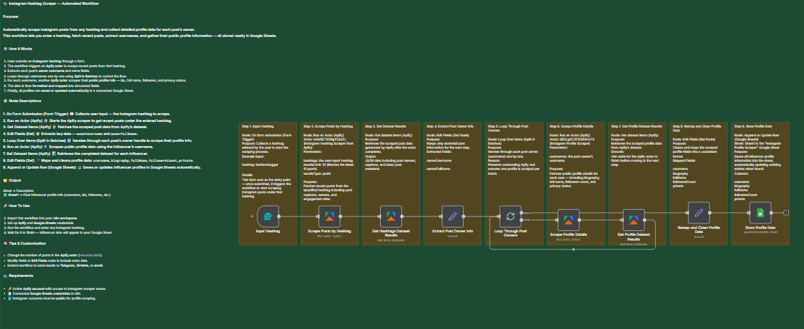

# 📸 **Instagram Hashtag Scraper — Automated Workflow**

Automatically scrape Instagram posts from any hashtag and collect detailed profile data for each post’s owner.  
This workflow lets you input a hashtag, fetch recent posts, extract usernames, and gather their public profile information — all stored neatly in Google Sheets.

---

## 🚀 **Overview**

This n8n workflow automates the process of discovering influencer profiles based on a chosen hashtag.  
It collects recent posts for that hashtag, extracts each post’s owner, and scrapes profile data such as bio, full name, follower count, and privacy status — all updated automatically in your Google Sheet.

**Main Features:**
- Scrape recent posts for any hashtag using **Apify**  
- Extract post owner usernames and loop through them for profile scraping  
- Collect influencer bio, full name, and followers count  
- Clean and format all results for a consistent Google Sheets dataset  
- Extend easily with **Telegram**, **Airtable**, or **Email** notifications  

---

## ⚙️ **Workflow Steps**

1. **Form Trigger** — Collects user input (the hashtag to scrape).  
2. **Run an Actor (Apify)** — Launches the Apify actor to scrape recent posts from the given hashtag.  
3. **Get Dataset Items (Apify)** — Fetches post data from Apify’s dataset.  
4. **Edit Fields (Set)** — Extracts important data such as `ownerUsername` and `ownerFullName`.  
5. **Split In Batches** — Loops through each username to control flow and avoid rate limits.  
6. **Run an Actor (Apify)** — Scrapes public profile details for each username.  
7. **Get Dataset Items (Apify)** — Retrieves completed influencer profile data.  
8. **Edit Fields (Set)** — Maps and cleans profile fields into a standard structure.  
9. **Append or Update Row (Google Sheets)** — Saves or updates influencer data automatically.

---

## 🧩 **Output**

| Sheet | Description |
|-------|--------------|
| 🟩 **Sheet1** | Final influencer profile info (username, bio, followers, etc.) |

---

## 🧠 **Tips & Customization**

- Adjust the number of posts per hashtag inside the Apify actor (`resultsLimit` field).  
- Add or remove profile fields in the “Edit Fields” node as needed.  
- Include filters or logic in the Code node to skip duplicates.  
- Extend this workflow to send influencer lists to **Airtable**, **Email**, or **Telegram**.  

---

## 🪪 **Requirements**

- 🔑 Active **Apify** account with access to Instagram scraper actors  
- 📄 Connected **Google Sheets** credentials in n8n  
- 🌐 Instagram accounts must be **public** for profile scraping  

---

## 🧰 **Preparation**

Before running, make sure you:
- Connect your **Apify** and **Google Sheets** credentials inside n8n  
- Create a target Google Sheet to store influencer data (e.g., `InstagramProfiles`)  
- Add a form or trigger node to input hashtags dynamically  

---

## 💡 **Example Use Case**

A marketing analyst wants to find micro-influencers posting under **#skincareegypt**.  
They enter the hashtag, run the workflow, and receive a clean Google Sheet containing each influencer’s username, full name, bio, and followers count — ready for outreach or CRM import.

---

## 📸 **Preview**

  

> *Workflow diagram showing the end-to-end process from hashtag input to Google Sheets export.*

---

## 👨‍💼 **About**

**Created by:** Sief Shama  
**Focus:** Automation Development · Data Engineering · AI Integration  
**LinkedIn:** [linkedin.com/in/siefshama](https://www.linkedin.com/in/siefshama/)
