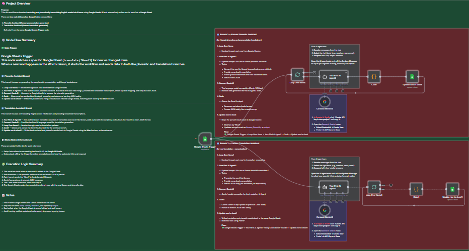

# 🧠 **English → Korean Translator & Phonetic Assistant (Google Gemini + Google Sheets)**

This n8n workflow automates **translating and phonetically transcribing English words into Korean** using **Google Gemini AI**, with all results automatically written back to a connected **Google Sheet**.

---

## 🚀 **Overview**

The workflow is designed to handle two AI-driven tasks in parallel:

1. **Translation Assistant** — Converts English words into their Korean equivalents.  
2. **Phonetic Assistant** — Generates phonetic and Hangul transcriptions for correct pronunciation.

Both assistants are powered by **Google Gemini** and managed entirely through n8n automations.

---

## ⚙️ **Workflow Structure**

The workflow starts from a **Google Sheets Trigger** that detects new or updated rows.  
When a new word is added, it activates two parallel branches:

### 🔁 **Phonetic Assistant Branch**
1. **Loop Over Items** — Iterates through each row from Google Sheets.  
2. **AI Agent (Phonetic Generator)** — Converts each English word into Hangul and phonetic form using Gemini.  
3. **Connect Gemini** — Sends the request to Google Gemini for processing.  
4. **Code (Cleaner)** — Parses and cleans AI responses into structured JSON.  
5. **Update Row in Sheet** — Writes the Hangul and phonetic results back to Google Sheets.

### 🔁 **Translation Assistant Branch**
1. **AI Agent (Translator)** — Translates each word into Korean and provides a romanized version.  
2. **Connect Gemini** — Connects to Gemini for translation generation.  
3. **Loop Over Items** — Iterates through rows for translation.  
4. **Code (Cleaner)** — Cleans Gemini responses.  
5. **Update Row in Sheet** — Writes translations back into the same Google Sheet.

---

## 📘 **Sheet Setup**

Prepare a Google Sheet with the following columns:

| Column | Description |
|---------|--------------|
| **Word** | Input English word |
| **Korean** | Translated Korean word |
| **Phonetic** | Korean pronunciation (romanized or Hangul) |
| **Output** | Optional field for structured AI response |

---

## 🧩 **Execution Flow Summary**

1. The workflow starts when a new word appears in the sheet.  
2. Both assistants (Translation & Phonetic) process it simultaneously.  
3. Each branch calls Google Gemini for its task.  
4. The Code nodes clean and parse the results.  
5. Updated Korean translations and phonetics are written back into the Google Sheet automatically.

---

## 🧠 **Notes & Best Practices**

- Ensure your **Google Sheets** and **Google Gemini** credentials are active and correctly connected.  
- The workflow works best when the sheet structure is fixed (Word, Korean, Phonetic).  
- Avoid running multiple workflows simultaneously to prevent sync errors.  
- You can modify the **AI Agent prompts** to adjust tone, output format, or add more linguistic details.  

---

## 🧪 **Example Use Case**

A language learner adds English words to a Google Sheet.  
Each time they add a new word, the workflow automatically fills in the Korean translation and phonetic pronunciation — providing instant bilingual reference without manual effort.

---

## 🪪 **Requirements**

- 🔑 Active **Google Gemini API** key (from Google AI Studio)  
- 📄 Connected **Google Sheets** credentials in n8n  
- ✅ Predefined Google Sheet with “Word”, “Korean”, and “Phonetic” columns  

---

## 📸 **Preview**

  

> *Workflow visualization showing AI integration and Google Sheets automation.*

---

## 👨‍💼 **About**

**Created by:** Sief Shama  
**Focus:** Automation Development · AI Integration · Language Workflows  
**LinkedIn:** [linkedin.com/in/siefshama](https://www.linkedin.com/in/siefshama/)
