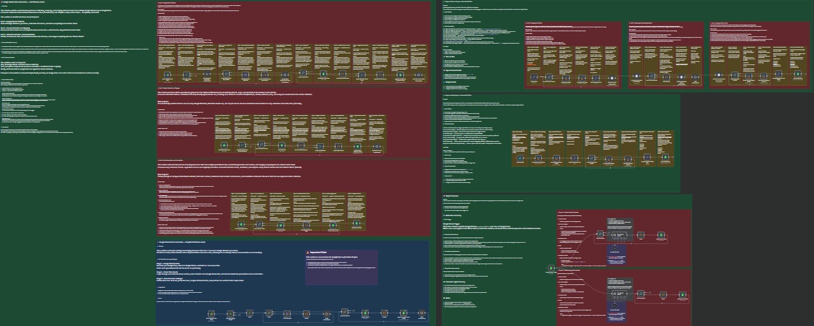

# 💼 **n8n Automation Projects Portfolio**

Welcome to my **n8n automation portfolio repository** — a curated collection of intelligent workflows I’ve built to automate real-world processes using **n8n**, **Google Sheets**, **Apify**, and **Google Gemini AI**.

Each project includes:

* A **complete JSON workflow** ready to import into n8n.  
* A **clear explanation** of how each node and process works.  
* **Usage guides** and **tips** for customization and automation scheduling.  

These projects demonstrate my ability to design scalable, low-code automations for data collection, AI integration, and business process management.

---

## 🖼️ **Top 4 Projects Overview**

  

> *Visual summary of my top 4 automation workflows — from data collection to AI-powered translation.*

---

## 🧩 **Included Projects**

### 1️⃣ **Google Sheets Data Automation — Full Workflow Guide**
Automates the process of collecting, analyzing, and merging influencer data from multiple Google Sheets.  
It detects all sheets in Google Drive, standardizes column names, cleans up inconsistencies, and merges them into a single unified **Master Sheet** — ready for analytics or CRM upload.  
**Tech used:** n8n, Google Sheets API, Google Drive API.  
**Focus:** Data standardization, cleaning, and automation.

---

### 2️⃣ **Instagram Influencer Scraper — Automated Workflow**
Discovers and collects influencer profiles from Instagram automatically.  
It starts with brand pages, scrapes posts, extracts tagged or mentioned users, cleans duplicates, and gathers public profile data — all stored in Google Sheets.  
**Tech used:** n8n, Apify, Google Sheets.  
**Focus:** Influencer discovery, data enrichment, and lead generation automation.

---

### 3️⃣ **Instagram Hashtag Scraper — Automated Workflow**
Fetches recent Instagram posts under any given hashtag and collects each post owner’s profile info.  
Profiles are automatically formatted and saved into Google Sheets for easy analysis or outreach.  
**Tech used:** n8n, Apify, Google Sheets.  
**Focus:** Hashtag-based influencer discovery and audience analysis.

---

### 4️⃣ **Korean Translation & Phonetic Assistant — Gemini AI Workflow**
Automates translating and phonetically transcribing English words into Korean using **Google Gemini AI**.  
The workflow updates translations and phonetic results directly within a connected Google Sheet in real-time.  
**Tech used:** n8n, Google Gemini API, Google Sheets.  
**Focus:** AI-powered translation, language learning, and automation of linguistic datasets.

---

## 🧠 **Skills Demonstrated**

* Building **end-to-end automations** with n8n  
* Integrating APIs like **Google Sheets**, **Apify**, and **Gemini AI**  
* **Data normalization and cleaning** for analytics  
* **Error handling**, batching, and scheduling automations  
* Designing **scalable workflow logic** with modular structure  

---

## ⚙️ **How To Use These Projects**

1. Clone this repository or download the individual `.json` files.  
2. Import the desired workflow into your **n8n workspace**.  
3. Connect the required credentials (Google, Apify, or Gemini).  
4. Adjust parameters, sheet names, or input fields as described.  
5. Run and customize each workflow for your own use case.  

---

## 📩 **Contact**

If you’re interested in automation projects, workflow design, or integrating AI into business processes, feel free to connect or reach out.

**👤 Author:** *Sief Shama*  

**💼 Focus:** *Automation Development · AI Integration · Data Workflows*  

**🌐 Portfolio:** *to be added once live*  

**📧 Email:** *siefshama@gmail.com*  

**🔗 LinkedIn / GitHub:** *[https://www.linkedin.com/in/siefshama/](https://www.linkedin.com/in/siefshama/)*
